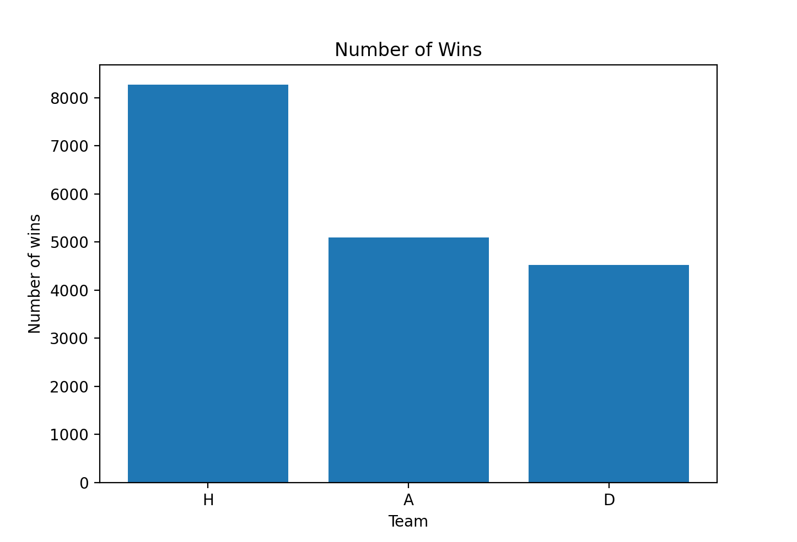

# Football Match Predictor

## Overview

This project uses Machine Learning to predict the result of a football match when given some stats from half time.

You can check out the demo here: https://football-predictor.projects.aziztitu.com/

## Data Source

After doing some research, I landed on this site: https://datahub.io/collections/football, which contained structured datasets for a variety of football competitions ranging from national leagues to world cups.

For this project, I decided to select the datasets for the top 5 European Leagues that contained the match results for the last 9 years.

Here are the links to the datasets that I used:
- https://datahub.io/sports-data/english-premier-league
- https://datahub.io/sports-data/spanish-la-liga
- https://datahub.io/sports-data/italian-serie-a
- https://datahub.io/sports-data/german-bundesliga
- https://datahub.io/sports-data/french-ligue-1


Initially, I thought this was a huge amount of data, but on a closer look, it is actually not that big. Each League contained around 380 matches per season. So that gives us around 17100 [380 * 5 * 9] matches in total.

## Data Pre-Processing / Data Analysis

Since the data that I obtained was already structured, it made this part a whole lot easier. But there were still a lot of work to be done.

The dataset had 62 different stats for each match, but I had to choose the right ones that have the highest impact on the match results.

<pre>
<b>Dataset Preview:
Note: The output column is FTR [H = Home Win, D = Draw, A = Away Win].

index Div        Date     HomeTeam    AwayTeam  FTHG  FTAG FTR  HTHG  ...  BbAvAHH BbMxAHA BbAvAHA   PSH   PSD    PSA  PSCH  PSCD   PSCA</b>

0          0  E0  2009-08-15  Aston Villa       Wigan     0     2   A   0.0  ...     1.22    4.40    3.99   NaN   NaN    NaN   NaN   NaN    NaN
1          1  E0  2009-08-15    Blackburn    Man City     0     2   A   0.0  ...     2.38    1.60    1.54   NaN   NaN    NaN   NaN   NaN    NaN
2          2  E0  2009-08-15       Bolton  Sunderland     0     1   A   0.0  ...     1.61    2.33    2.23   NaN   NaN    NaN   NaN   NaN    NaN
3          3  E0  2009-08-15      Chelsea        Hull     2     1   H   1.0  ...     1.02   17.05   12.96   NaN   NaN    NaN   NaN   NaN    NaN
4          4  E0  2009-08-15      Everton     Arsenal     1     6   A   0.0  ...     2.20    1.73    1.63   NaN   NaN    NaN   NaN   NaN    NaN
...      ...  ..         ...          ...         ...   ...   ...  ..   ...  ...      ...     ...     ...   ...   ...    ...   ...   ...    ...
17875    375  I1  26/05/2019        Inter      Empoli     2     1   H   0.0  ...     2.05    1.85    1.81  1.39  5.35   7.81  1.27  6.36  10.94
17876    376  I1  26/05/2019         Roma       Parma     2     1   H   1.0  ...     1.85    2.10    2.01  1.20  7.50  14.07  1.17  8.59  16.35
17877    377  I1  26/05/2019    Sampdoria    Juventus     2     0   H   0.0  ...     1.96    1.95    1.90  3.92  3.98   1.93  3.06  3.55   2.40
17878    378  I1  26/05/2019         Spal       Milan     2     3   A   1.0  ...     2.02    1.89    1.84  6.25  4.51   1.54  5.41  4.30   1.63
17879    379  I1  26/05/2019       Torino       Lazio     3     1   H   0.0  ...     2.03    1.88    1.84  2.34  3.76   3.01  2.36  3.56   3.12
</pre>

### Cleaning up the data
Firstly, there were a few missing data inside the dataset. For features such as HomeGoals, and AwayGoals, I was able to replace the missing data with the average value of the respective team. But for features such as HomeTeam, AwayTeam, League, or any other discrete feature, I decided the best option was simply to drop those rows. Since the number of such rows was very small (less than 20), it was okay to drop them.

<pre>
<b>Rows with missing values (NaN):

home_encoded  away_encoded  HTHG  HTAG    HS    AS  HST  AST   HR   AR FTR  ...</b>

10585            16            95   NaN   NaN   NaN   NaN  NaN  NaN  NaN  NaN   A
15254            35           129   NaN   NaN   NaN   NaN  NaN  NaN  NaN  NaN   A
16757           132           121   NaN   NaN  13.0  15.0  3.0  5.0  0.0  0.0   A
...
...
</pre>


### Feature Selection:

Now that the data was clean, it was time to find out which features contributed the most towards the match results.

I started out by visualizing the distribution of some of the features that I thought were useful.

**Home/Away Distribution:**<br/>


Analyzing the Home/Away distribution, it was obvious that the match results favor the Home teams way more than the Away teams.

**Shots:**

Two of the features that I thought were very important but turned out otherwise were 'Home Shots' and 'Away Shots'. On further exploration, I found that these had very little impact, if any, on the final results. But, what did have a massive impact were the 'Home Shots on Target', and 'Away Shots on Target'.

**Yellow/Red Card:**

The number of yellow cards seemed to have little to no impact on the result. But the number of red cards however had a tremendous impact.

**Statistical Tests:**

After exploring some of the features manually, I went on to perform some statistical tests to see if these features were truly important.

This is common problem in applied machine learning where you have to determine whether certain input features are relevant to the outcome.

In the case of classification problems where input variables are also categorical, we can use statistical tests to determine whether the output variable is dependent or independent of the input variables. If independent, then the input variable is a candidate for a feature that may be irrelevant to the problem and can possibly be removed from the dataset.

One such test is the Pearson’s Chi-Squared statistical hypothesis. This was the result from the Chi-Squared Analysis:

<pre>
HC is NOT an important predictor
AC is NOT an important predictor
HY is NOT an important predictor
AY is NOT an important predictor
AF is IMPORTANT for Prediction
AR is IMPORTANT for Prediction
AS is IMPORTANT for Prediction
AST is IMPORTANT for Prediction
HC is IMPORTANT for Prediction
HF is IMPORTANT for Prediction
HR is IMPORTANT for Prediction
HS is IMPORTANT for Prediction
HST is IMPORTANT for Prediction
HTAG is IMPORTANT for Prediction
HTHG is IMPORTANT for Prediction
ht_label is IMPORTANT for Prediction
at_label is IMPORTANT for Prediction
</pre>

Another problem that we have is Collinearity, which is the state where two variables are highly correlated and contain similiar information about the variance within a given dataset. Add in more features that are collinear of each others and we get multicollinearity.

One of the methods we can use to check for multicollinear variables is calculating the Variance inflation factor (VFI). A high VIF indicates that the associated independent variable is highly collinear with the other variables in the model.

After calculating the VIF on this dataset, I found the following variables to have high VIF:

```
HS: 9
AS: 4
HF: 5
AF: 2
```

The earlier observation regarding the Home and Away shots is verified from this test. And we've also found more variables that are collinear.

After dropping the unnecessary features, these are the once I selected:

```
home_encoded    non-null float64
away_encoded    non-null float64
HTHG            non-null float64
HTAG            non-null float64
HST             non-null float64
AST             non-null float64
HR              non-null float64
AR              non-null float64
```

